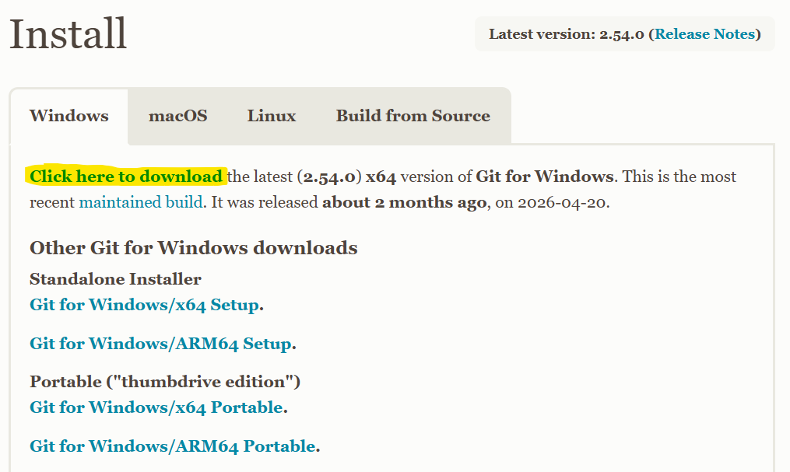
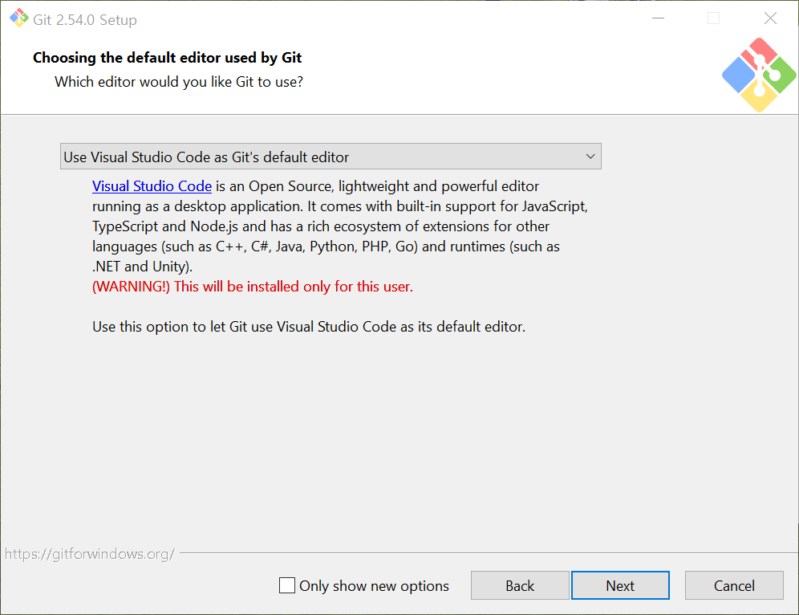

### GIT

+ 공식 사이트
    + https://git-scm.com/
    + 설치파일 받기
        + https://git-scm.com/install/windows
        + 
    + 설치 옵션
        + 
    + 다른 옵션은 기본으로 진행합니다

    + 설치가 완료되면, CMD / powershell / vs code 등은 재시작합니다

+ GIT 
    + 형상관리 프로그램
    + 저장소 단위로 형상관리
    + 저장소를 생성
    + 설정
        + 누가??? : 이름
        + 연락처 : 이메일
    + '개발 협업'시 형상관리
    + 언제 누가 어느파일의 어느곳을 어떻게 무엇을 했는지 기록
    + 우리가(개발자) GIT에게 기록해달라고 명령

+ 명령
    + 사용자 설정하기
        + 전역 설정으로 이름 입력하기
        ```shell
        git config --global user.name "이름입력"
        ```
        + 전역 설정으로 이메일 입력하기
        ```shell
        git config --global user.email "이메일주소입력"
        ```

    + 사용자 정보 확인하기
        ```shell
        # 이름 확인
        git config --global user.name
        # 이메일 확인
        git config --global user.email
        ```

    + 현재 작업 폴더를 GIT 저장소로 만들기
        ```shell
        git init 
        ```
    + 특정 저장소에만 이름 / 이메일 적용하기
        + GIT 저장소가 있는 폴더에서
        ```shell
        # 입력하기
        git config user.name "이름입력"
        git config user.email "이메일주소입력"
        # 확인하기
        git config user.name
        git config user.email
        ```

+ 파일 형상관리하기
    + GIT 저장소에서 파일을 생성합니다
        + 01.txt 
    + GIT 저장소 상태 확인
        ```
        git status
        # -> 01.txt 파일이 관리되고 있지 않습니다
        ```
        ```
        On branch master

        No commits yet

        Untracked files:
        (use "git add <file>..." to include in what will be committed)
                01.txt

        nothing added to commit but untracked files present (use "git add" to track)
        ```
    + '01.txt' 파일을 '관리대상'에 추가하기
        ```
        git add 01.txt
        ```
        ```
        git status
        On branch master

        No commits yet

        Changes to be committed:
        (use "git rm --cached <file>..." to unstage)
                new file:   01.txt
        ```
        + 01.txt는 형상관리 대상 목록에 추가 != 형상관리 수행
    + 관리 대상 파일들의 '변경내용'을 형상관리 해줘
        ```
        git commit -m "작업내용"
        [master (root-commit) f3b0c7f] 01.txt 파일 생성
        1 file changed, 0 insertions(+), 0 deletions(-)
        create mode 100644 01.txt
        # 저상소 상태 확인
        git status
        On branch master
        nothing to commit, working tree clean
        ```
    + 형상관리 내용 확인하기
        ```
        # 형상관리 상세내용 확인
        git log
        # 한줄요약으로 확인
        git log --oneline
        ```

+ 작업 순서
    + 파일 생성 / 수정 / 삭제 등등 작업
    + 'add'명령 실행
        + 파일을 stage 상태로 변경하기
    + 'commit' 명령 실행
        + stage 된 파일들의 작업 내용을 형상관리에 등록
        + commit시 메세지는 반드시 작성해야 합니다

+ 형상관리 대상에서 제외시키기
    + '.gitignore' 파일을 저장소에 생성
    + 파일명 / 폴더명 등을 작성
    + 해당되는 파일, 폴더는 형상관리 대상에서 제외됩니다
    + **이미 관리되고 있는 파일**은 나중에 제외 목록에 추가되어도 형상관리됩니다

+ gitignore 파일의 템플릿 제공하는 사이트
    https://www.gitignore.io/

+ 여러 파일을 한번에 스테이징하기
    + uv / eclipse 등을 통해 프로젝트를 템플릿으로 생성한 경우
        + 너무 많은 폴더와 파일이 생성되어, 각각의 파일들을 add하는것은 말이 안됩니다
    ```
    git add .
    ```
    + .gitignore 파일을 생성하지 않은 상황에서는 사용하지 마세요

+ stage 취소하기
    + git restore --staged '파일명'
    + stage 작업은 다시 할 수 있습니다

+ 파일 수정 내용 취소하기
    + git restore '파일명'
    + 변경내용 취소는 되돌릴 수 없습니다

+ 이전 커밋으로 되돌리기
    ```
    git reset --soft 커밋해쉬값
    ```
    + --soft : 되돌리기 이전의 내용을 stage 상태로 남김
    ```
    git reset --hard 커밋해쉬값
    ```
    + --hard : 선택된 커밋 이후의 모든 작업 완전 삭제
        + 복구 불가
    + git 2.23 버전 이전
        + checkout

+ 이전 커밋으로 HEAD만 이동을 하고 싶습니다
    + HEAD 이동의 효과
        + 해당 커밋의 프로젝트 파일 내용을 확인
    + reset 명령과 다릅니다
    ```
    git switch --detach 해당커밋의해쉬값
    git switch -d 해당커밋의해쉬값
    ```
    + 최신으로 되돌아오기
    ```
    git switch 브랜치이름(원래기둥 master main)
    ```

+ 브랜치(가지)
    + 프로젝트의 형상관리 내용을 tree 구조로 여러가지 버전을 만들고 싶을때에는 '가지'를 생성하거나 '가지'간의 이동을 사용합니다

    + 현재 tree 상태 확인하기
        ```
        git branch
        ```
    + 새로운 브랜치 생성하기
        ```
        git branch 브랜치 이름
        ```
    + 현재 폴더에 표시할 브랜치 선택
        ```
        git switch 브랜치 이름
        ```