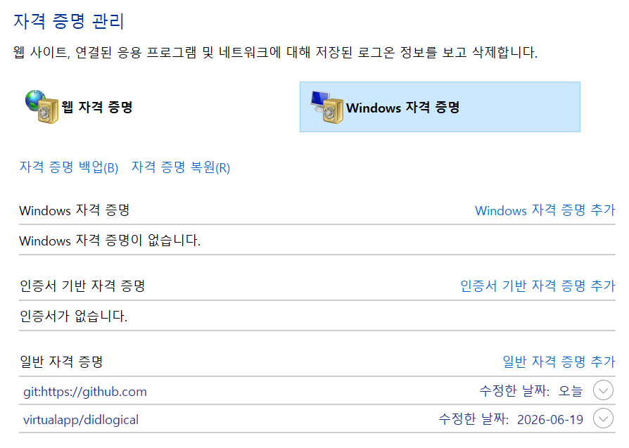
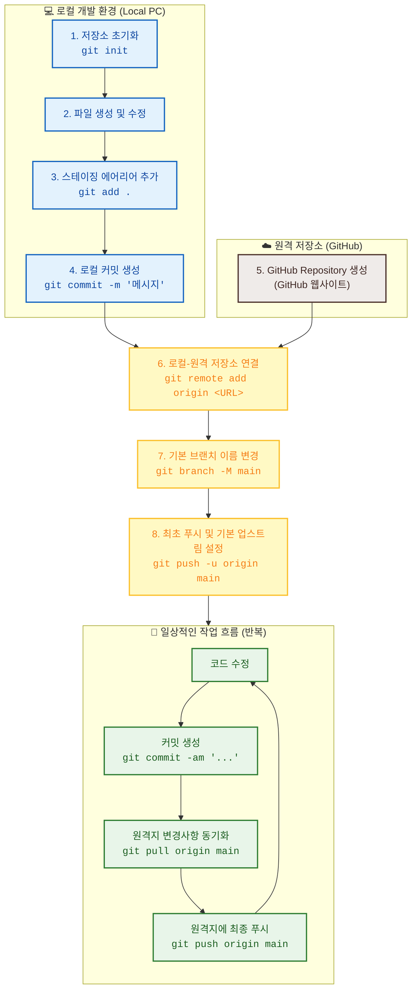

### GITHUB

+ 온라인 클라우드 서버로 제공되는 GIT 저장소 서비스

+ https://github.com/Ezenitac-AiService/GITEX.git

```
# 실습할 폴더로 이동
cd GITHUB01
git clone https://github.com/Ezenitac-AiService/GITEX.git
```

+ main 브랜치 : github의 저장소 주 브랜치 이름은 'main'입니다

+ 온라인 저장소와 로컬 저장소를 복제라는 수단으로 연결
+ origin : 온라인 저장소

+ 온라인 저장소의 변경 내용을 로컬 저장소에 반영해주세요
```
git pull origin main
```

+ 현재 로컬 저장소가 어느 온라인 저장소와 연결되어있습니까?
```
git remote -v
```

+ 복제된 로컬 저장소의 파일들에 대한 '모든 권한'은 여러분에게 있습니다
+ 형상관리 가능

+ 로컬 저장소의 내용을 온라인 저장소에 반영하는것은 여러분이 '온라인 저장소에 어떤 권한이 있는가?'에 따릅니다

+ push : 로컬 저장소의 내용을 온라인 저장소에 반영해주세요
```
git push -u origin main
```

+ github 인증이 진행됩니다

+ github 인증 내용은 '자격 증명 관리자'앱에서 확인할 수 있습니다

+ 


